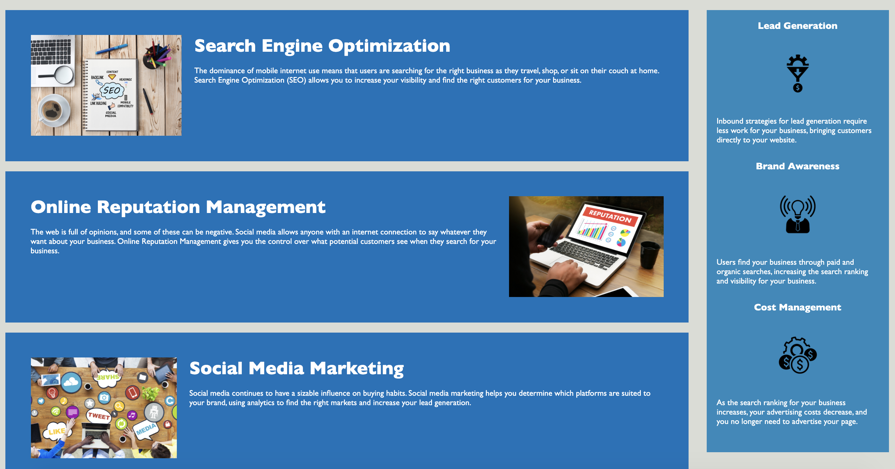

# Code-Refractor
<h1> Code Refractor Assignment </h1>
 
For this assignment we were given an index.html file and style.css file along with an Assets/ Images folder. Those files all had broken or unorganized parts to them and as a developer we were assigned to rework the files to make sure they were optimzied for the user experience but also for the developers code. 

Below I have screen shots of the completed webpage and a link to the actual homework page, where all criteria of the assignment is met. 

## Screen Shot of Completed Work

## Link to deployed application
https://sawi4644.github.io/homework-1/